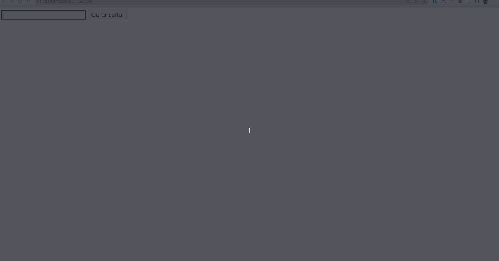

## O que é o projeto Trybe Mistery Letter

Para este projeto, tive que desenvolver um gerador de carta anônima/secreta, utilizando HTML, CSS e Javascript, com o intuíto de aprofundar meus conhecimentos com manipulação do DOM.

A pessoa usuária pode escrever uma mensagem e ao clicar no botão de "Gerar carta!" receberá a mensagem de volta com estilos diferentes para parecer uma carta misteriosa!

## Exemplo:

